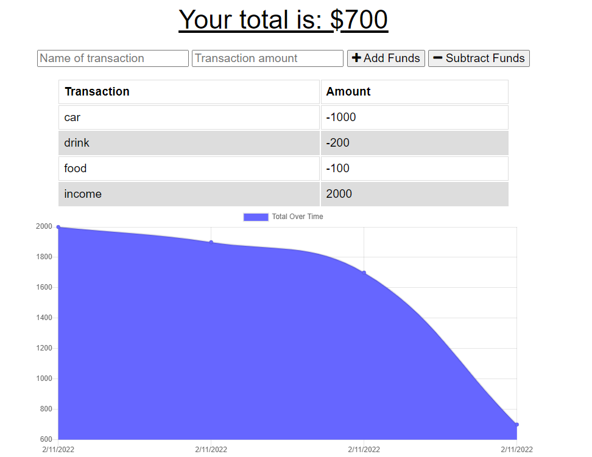

# Budget-Tracker
This is a Progrisive web application (PWA) for trackeing Budget , where users can track their budget even when they dont have network access . 

# User Story

AS AN avid traveler
I WANT to be able to track my withdrawals and deposits with or without a data/internet connection
SO THAT my account balance is accurate when I am traveling 

# Application screen shot 

 

# Deployed application URL

   https://pacific-coast-49689.herokuapp.com/

# Technologies

- JavaScript
- Node.js
- MongoDB
- Mongoose
- IndexedDB
- Service Worker
- Express.js

# License

MIT license